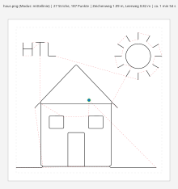

# Deltaroboter – Stift-Plotter

Software für unseren selbstgebauten Deltaroboter mit Stifthalter (HTBLA Kaindorf, KOP-Projekt).
Hardware: 3 × Dynamixel **XL430-W250-T**, gesteuert von einem ROBOTIS **OpenRB-150**.

Das Repository enthält zwei Teile, die zusammenarbeiten:

```
Bild / SVG ──► Converter (Python, am PC) ──► zeichnung.h ──► Arduino-Sketch DeltaPlotter (OpenRB-150)
                                         ├─► zeichnung.gcode         Startposition → Bild → Endposition
                                         └─► zeichnung_vorschau.svg
```

| Teil | Ordner | Aufgabe |
|---|---|---|
| **Converter** | `deltaconvert/`, `config/` | macht aus einem Bild Zeichenpfade (G-Code, Arduino-Header, Vorschau) |
| **Sketch** | `arduino/DeltaPlotter/` | rechnet die Pfade über die inverse Kinematik in Motorwinkel um und fährt sie ab |



*Schwarz = gezeichnet, rot gestrichelt = Leerfahrt mit angehobenem Stift, grün = Start, blau = Ende.*

---

## Auf einem neuen Rechner einrichten (Windows oder Linux)

1. Repository mit **GitHub Desktop** klonen (File → Clone repository). Am besten in einen Ordner
   **außerhalb von OneDrive**.
2. **Python 3.11+** installieren ([python.org](https://www.python.org/downloads/), unter Windows
   „Add Python to PATH“ anhaken) und im Repo-Ordner:
   ```bash
   python -m venv .venv
   # Windows:  .venv\Scripts\activate      Linux:  source .venv/bin/activate
   python -m pip install -r requirements.txt
   ```
3. **Arduino IDE**: Unter *File → Preferences → Additional boards manager URLs* eintragen:
   `https://raw.githubusercontent.com/ROBOTIS-GIT/OpenRB-150/master/package_openrb_index.json`
   Dann im Boards Manager **OpenRB-150** und im Library Manager **Dynamixel2Arduino** installieren.
4. Nur Linux: Damit das Hochladen klappt, einmal `sudo usermod -a -G dialout $USER` und neu anmelden.

---

## Teil 1: Converter

```bash
python -m deltaconvert beispiele/haus.png                 # Ausgabe landet in ausgabe/
python -m deltaconvert logo.png -m kontur                 # Umrisse zeichnen
python -m deltaconvert skizze.jpg -m mittellinie          # Linien nur einmal (Mittellinie) zeichnen
python -m deltaconvert foto.jpg -m kanten                 # Kantenerkennung für Fotos
python -m deltaconvert bild.png -s 100                    # eigener Schwellwert statt automatisch
python -m deltaconvert bild.png -i                        # helle statt dunkle Bereiche zeichnen
python -m deltaconvert bild.png -f header -o arduino/DeltaPlotter   # nur .h, direkt in den Sketch
python -m deltaconvert --help                             # alle Optionen
```

| Modus         | Was wird gezeichnet?                          | Geeignet für                            |
|---------------|-----------------------------------------------|-----------------------------------------|
| `kontur`      | Umriss jeder dunklen Fläche                    | Logos, Silhouetten, ausgefüllte Formen  |
| `mittellinie` | die Mitte jeder dunklen Linie, nur **einmal**  | Strichzeichnungen, Skizzen, Schrift     |
| `kanten`      | erkannte Kanten (Canny)                       | Fotos                                   |
| *SVG*         | jede Form genau so, wie sie in der Datei steht | Vektorgrafiken (Inkscape); Texte vorher in Pfade umwandeln |

### Konfiguration – `config/plotter.toml`

| Abschnitt          | Inhalt                                                                  |
|--------------------|-------------------------------------------------------------------------|
| `[zeichenflaeche]` | Gesamtgröße der Fläche (± halbe Breite/Höhe um die Mitte) und Rand nach innen |
| `[stift]`          | Z-Höhe beim Zeichnen (normal 0) und bei Leerfahrten                       |
| `[vorschub]`       | Geschwindigkeiten in mm/min (÷ 60 = mm/s)                                |
| `[startposition]`, `[endposition]` | wo der Roboter vor bzw. nach dem Zeichnen steht         |
| `[bild]`           | Modus, Schwellwert, Glättung (nur für Rasterbilder)                      |
| `[pfade]`          | Vereinfachung, Mindestlänge, Optimierung der Reihenfolge                 |
| `[ausrichtung]`    | Drehen (0/90/180/270°) und Spiegeln                                      |

**Papier-Koordinaten:** Ursprung = Mitte der Zeichenfläche, X nach rechts, Y nach oben (Blick aufs
Blatt), **Z = 0 = Stiftspitze berührt das Papier**, alles in mm. Wo das Papier für den Roboter liegt,
weiß nur der Sketch (`PAPIEREBENE_Z`). Der Converter braucht keine Robotermaße.

### Ausgabe

- **`.gcode`**: G21/G90, `G0` Leerfahrt, `G1` Zeichnen, Stift über Z heben/absetzen. Ansehen z. B. auf [ncviewer.com](https://ncviewer.com).
- **`.h`**: alle Punkte als Array (`int16`, 1/100 mm, 6 Byte pro Punkt) plus Start-/Endposition,
  Z-Höhen und Vorschübe. Liegt auf dem OpenRB-150 im Flash (256 KB), nicht im RAM.
- **`_vorschau.svg`**: maßstabsgetreue Vorschau, im Browser öffnen.

---

## Teil 2: Arduino-Sketch `arduino/DeltaPlotter`

In der Arduino IDE **File → Open → `arduino/DeltaPlotter/DeltaPlotter.ino`**, Board **OpenRB-150**,
hochladen, Seriellen Monitor mit **115200 Baud** öffnen.

| Datei | Inhalt |
|---|---|
| `DeltaPlotter.ino` | Hauptprogramm, Befehle über den Seriellen Monitor, **welche Zeichnung** |
| `Konfiguration.h`  | **alle Maße und Einstellungen** (Geometrie, Papierlage, Motor-IDs, Kalibrierung) |
| `Kinematik.h`      | inverse Kinematik (Formeln wie im Berechnungsbericht) |
| `Motoren.h`        | Dynamixel-Ansteuerung, alle 3 Sollwerte in einem SyncWrite-Paket |
| `Bewegung.h`       | Geraden mit 50 Sollwerten/s, Prüfung vorab, Abbruch |
| `DeltaTypen.h`     | Datentypen der Converter-Ausgabe |
| `triangle.h`       | Beispielzeichnung (aus `beispiele/triangle.png`) |

### Zeichnung wechseln

```bash
python -m deltaconvert meinbild.png -f header -o arduino/DeltaPlotter
```

und in `DeltaPlotter.ino` die zwei Zeilen anpassen:

```cpp
#include "meinbild.h"
const DeltaZeichnung& ZEICHNUNG = zeichnung_meinbild;
```

### Befehle (Serieller Monitor)

| Befehl | Wirkung |
|---|---|
| `z` | Zeichnung abfahren: Startposition → Bild → Endposition (jede Eingabe = **Abbruch**) |
| `p` | prüfen, ob alle Punkte erreichbar sind |
| `s` | Startposition langsam anfahren |
| `g X Y Z` | zu einer Papier-Koordinate fahren, z. B. `g 0 0 10` |
| `+` / `-` | Stift um 0,5 mm heben / senken |
| `k` | Kalibrieren: Drehmoment aus, Motorwinkel live anzeigen |
| `a` | Drehmoment aus |
| `t` | Trockenlauf ein/aus |
| `?` | Hilfe |

Ohne angeschlossene Motoren läuft der Sketch automatisch im **Trockenlauf**: Er rechnet alles durch
und gibt Positionen und Oberarmwinkel aus, bewegt aber nichts.

### Inbetriebnahme am Roboter

Die Werte in `Konfiguration.h` mit `PLATZHALTER` stammen aus dem Berechnungsbericht und müssen am
echten Roboter geprüft werden:

1. **Motor-IDs** (`MOTOR_ID`) prüfen: Motor 1 liegt auf der x-Achse, 2 und 3 folgen gegen den Uhrzeigersinn (von oben).
2. **`k`**: Oberarme nacheinander waagrecht halten → angezeigter Winkel = `NULLPOSITION`.
   Oberarm nach unten drücken: Wert steigt → `RICHTUNG = +1`, sinkt → `-1`. Eintragen, neu hochladen.
3. **Papierebene**: `g 0 0 10`, dann mehrmals `-`, bis der Stift das Papier berührt.
   Den angezeigten Wert „Stiftspitze im Roboter-KS“ als `PAPIEREBENE_Z` eintragen, danach `Z_MIN` auf ca. `-1`.
4. **`p`**: Zeichnung prüfen.
5. **Erster Lauf** mit `z`: zur Sicherheit vorher in `config/plotter.toml` `z_zeichnen` z. B. auf 20 setzen
   (zeichnet dann in der Luft), Header neu erzeugen, kontrollieren, dann zurück auf 0.

---

## Ordnerstruktur

```
deltaroboter/
├── deltaconvert/            Converter (Python-Paket)
├── config/plotter.toml      Einstellungen des Converters
├── arduino/DeltaPlotter/    Arduino-Sketch für den OpenRB-150
├── beispiele/               Beispielbilder und erzeugte Ausgaben
└── tests/                   automatische Tests (Converter + Sketch-Simulation)
```

## Tests

```bash
python -m pip install pytest
python -m pytest
```

Getestet werden der Converter und der Sketch: Der Sketch wird mit einem Arduino- und Dynamixel-Ersatz
(`tests/arduino_mock`) auf dem PC ausgeführt, die Kinematik wird gegen eine eigene Python-Rechnung
geprüft. Bei jedem Push laufen auf GitHub die Tests, und der Sketch wird zusätzlich mit dem echten
OpenRB-150-Board-Paket kompiliert (Reiter **Actions**).

## Nächste Schritte

- [ ] Inbetriebnahme am Roboter (siehe oben)
- [ ] erster Zeichentest, danach Vorschübe steigern
- [ ] Ideen: Schraffur für Flächen, Zeichnungen über USB senden statt einkompilieren

---
HTBLA Kaindorf · KOP-Projekt Deltaroboter
